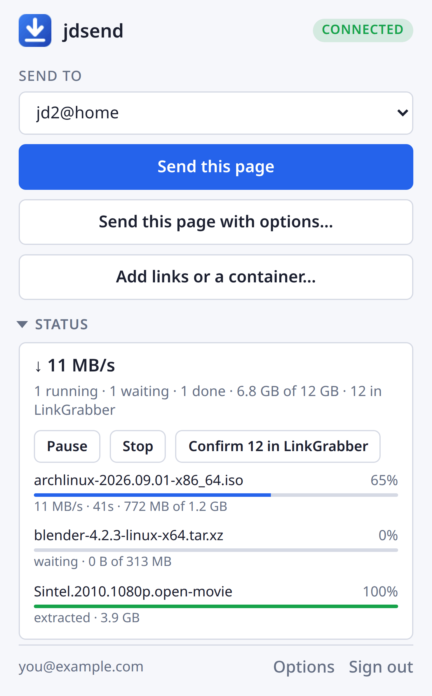
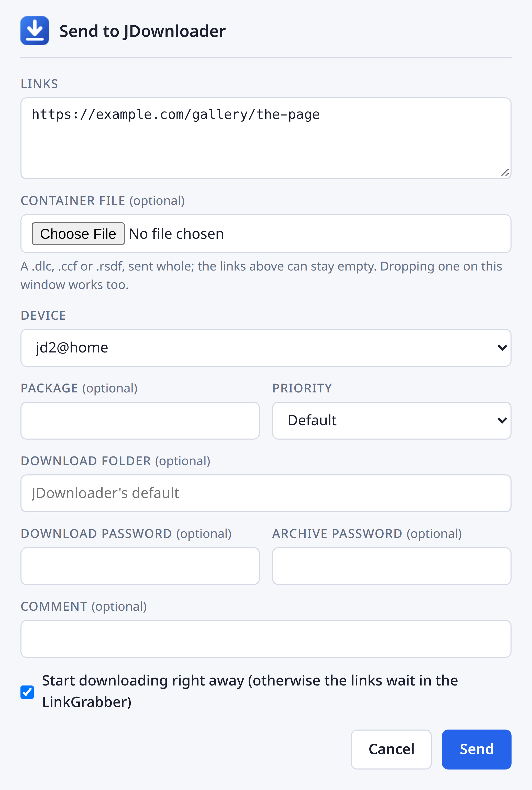

# jdsend

[](https://github.com/rylos/jdsend/releases/latest)
[](LICENSE)

Send links to [JDownloader](https://jdownloader.org/) from the browser, through My.JDownloader — wherever that JDownloader runs.

Right-click a link, an image, a video, some selected text or the page itself and it goes straight away; the toolbar button sends the current page, and so does `Alt+Shift+J`. Unfold *Status* for a glance at the JDownloader, with the controls to go with it. No server of its own, no polling, no code on the pages you visit.

<table>
  <tr>
    <td width="45%" valign="top">
      <picture>
        <source media="(prefers-color-scheme: dark)" srcset="docs/popup-dark.png">
        
      </picture>
    </td>
    <td width="55%" valign="top">
      <picture>
        <source media="(prefers-color-scheme: dark)" srcset="docs/dialog-dark.png">
        
      </picture>
    </td>
  </tr>
  <tr>
    <td align="center"><em>The popup, with <strong>Status</strong> unfolded</em></td>
    <td align="center"><em><strong>Send with options…</strong></em></td>
  </tr>
</table>

Companion of [jdtui](https://github.com/rylos/jdtui), a terminal UI for the same JDownloader.

## Install

Grab the zip for your browser from the [latest release](https://github.com/rylos/jdsend/releases/latest).

**Chrome, Brave, Edge, Vivaldi, Opera** — unzip it somewhere it can stay, open the extensions page (`chrome://extensions`, `brave://extensions`, `edge://extensions`), turn on *Developer mode* and choose *Load unpacked* on the folder. Cloning this repository and loading the checkout works too, and then `git pull` and the ↻ on the extension's card are all an update takes.

**Firefox** — `about:debugging#/runtime/this-firefox` → *Load Temporary Add-on…* on the Firefox zip. Firefox forgets temporary add-ons when it closes; a permanent install needs Mozilla's signature, which is on the list.

Then click the toolbar icon and sign in with your My.JDownloader account.

## Use

- **Context menu** — *Send to jd2@home*, named after the JDownloader chosen in the options, sends without asking. *Send with options…* opens the form first, for when the package, the folder, the priority or a password matter.
- **Toolbar and keyboard** — the button sends the current page, `Alt+Shift+J` does the same without opening anything, and a badge on the icon says whether it arrived.
- **Links and containers** — *Add links or a container…* opens the form empty: paste links or any text with links in it, and/or pick a `.dlc`, `.ccf` or `.rsdf` — or drop one on the window.
- **Status** — speed, what is downloading and how far along, what waits in the LinkGrabber, with Start/Pause/Stop and a button to confirm the whole LinkGrabber. It asks only while the popup is open and unfolded.

## Options

Right-click the toolbar icon → *Options*, or the popup's *Options* link:

| | |
| --- | --- |
| **Device** | Where quick sends go. With none chosen, every send opens the form. |
| **Priority**, **Download folder**, **Start right away** | What a quick send uses, and what the form starts from. A folder set here beats JDownloader's packagizer rules; leave it empty and the rules decide. |
| **Remember whether Status is unfolded** | Off by default, so the popup opens folded and asks the JDownloader nothing. On, it opens the way you left it. |

The shortcut is changed where the browser keeps extension shortcuts (`chrome://extensions/shortcuts`, or *Manage Extension Shortcuts* in Firefox's add-ons page).

## What it sends, and where

Everything goes to `https://api.jdownloader.org`, the My.JDownloader relay, encrypted end to end with keys only your JDownloader shares — the same protocol JDownloader's own web interface and apps use. jdsend has no server of its own, does not check for updates, and phones nowhere else.

Signing in derives two keys from the e-mail and password and keeps them in the browser's extension storage; the password itself is discarded. Those keys open sessions without asking again, which makes them worth as much as the password — as they are in JDownloader itself. *Sign out* forgets them and ends the session on the server.

## Verify a download

Every release is built by GitHub Actions and signed with the maintainer's SSH key; the public half is in [`.github/allowed_signers`](.github/allowed_signers), fingerprint `SHA256:A8FoTqTFZrY18WXrAuT1mA2xnmoc4xTDCNIzkQPRjdA`. To check the checksums and, through them, the zips:

```sh
ssh-keygen -Y verify -f allowed_signers -I rylos78@gmail.com -n file -s SHA256SUMS.sig < SHA256SUMS
sha256sum --check --ignore-missing SHA256SUMS
```

Commits and tags are signed with the same key.

## Development

Plain JavaScript, no build step, no dependencies. The source tree is a Chrome extension as it is; `scripts/package.sh` produces the Chrome zip and the Firefox one, whose manifest differs only in the background page, the add-on id and the `key` it has no use for.

```sh
node --test                       # the protocol against reference vectors, the client against a fake server
scripts/package.sh                # dist/jdsend-<version>-{chrome,firefox}.zip
JDSEND_EMAIL=… JDSEND_PASSWORD=… node scripts/live-check.mjs   # a real login, list, reconnect and sign out
```

`js/myjd.js` is the whole My.JDownloader client and has no browser in it: it runs in the Chrome service worker, the Firefox event page and Node alike.

The `key` in the manifest is the public half of an RSA key, and it is what Chromium derives the extension id from — `mijmmcemhgdiopefdajfbmpcgjaajkna`, the same wherever the folder sits. Without it the id follows the path, so the same extension moved elsewhere is a different one, with an empty storage and a sign-in to do again. The private half signs a `.crx`, which nothing here builds, so it stays out of the repository.

## License

MIT — see [LICENSE](LICENSE).
